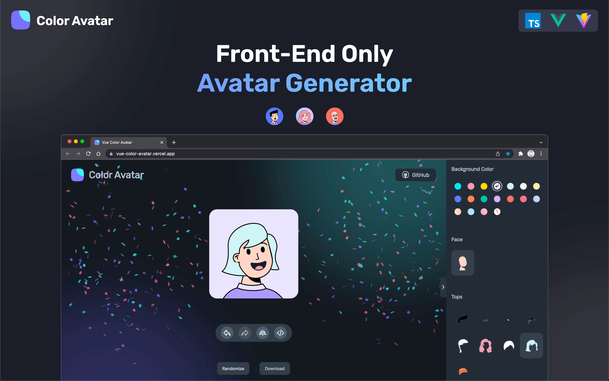

<div align="center">
  <h1>Vue Color Avatar</h1>

  <p>🧑‍🦱 A playful avatar generator 🧑‍🦳</p>

[简体中文](./README-CN.md)

</div>

<a href="https://vue-color-avatar.leoku.dev">
  
</a>

## Preview

[`https://vue-color-avatar.leoku.dev`](https://vue-color-avatar.leoku.dev)

## Introduction

**This is a vector style avatar generator, you can match different material components to generate your own personalized avatar.**

Features you might be interested in:

- Visual component configuration bar
- Randomly generate an avatar
- Redo/Undo
- i18n
- Generate multiple avatars in batch

## Assets

> **Note**  
> The avatar assets implementation of [Avatar Illustration System](https://www.figma.com/community/file/829741575478342595) by Micah Lanier. And the licensed under [CC BY 4.0](https://creativecommons.org/licenses/by/4.0/).

## Develop

This project is built with `Vue3` + `Vite`.

```sh
# 1. Clone project
git clone https://github.com/Codennnn/vue-color-avatar.git

# 2. Install dependencies
yarn install

# 3. Run
yarn dev
```

## Docker deploy

```sh
#clone the code
git clone https://github.com/Codennnn/vue-color-avatar.git

#docker build
cd vue-color-avatar/
docker build -t vue-color-avatar:latest .

#start server
docker run -d -p 3000:80 --name vue-color-avatar vue-color-avatar:latest
```

Once the container is running, open your browser and visit:

- http://localhost:3000 (if running locally)
- http://your-server-ip:3000 (if running on a server)
