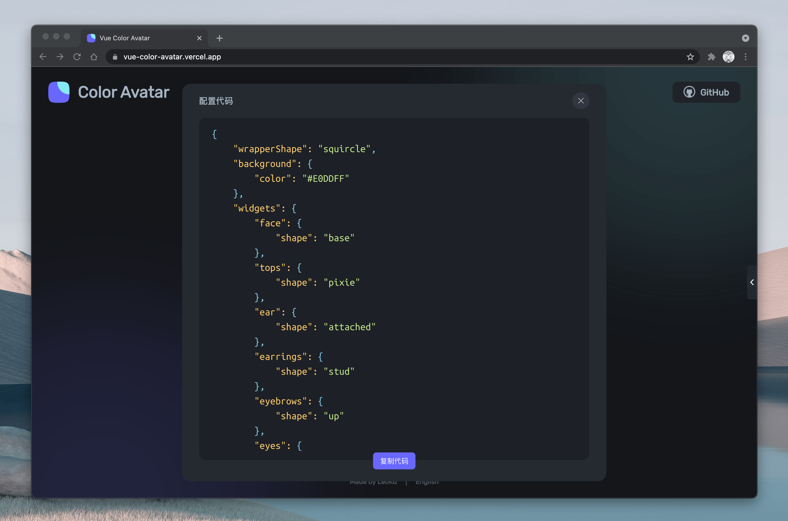

<div align="center">
  <h1>Vue Color Avatar</h1>

  <p>🧑‍🦱 一个纯前端实现的头像生成网站 🧑‍🦳</p>

[Read In English](./README-EN.md)

</div>




## 在线预览

[`https://vue-color-avatar.vercel.app`](https://vue-color-avatar.vercel.app)

## 🥳 介绍

根据你喜好的风格，通过组合不同的头像组件来生成生成千变万化的头像。

## 设计资源

目前该项目所使用的所有头像素材均来自于 [Figma 社区](https://www.figma.com/community/file/829741575478342595)，作者：Micah Lanier。请注意，虽然该项目是 MIT 协议，但是素材的设计基于 [CC BY 4.0](https://creativecommons.org/licenses/by/4.0/) 协议。如果你有好的创意素材，欢迎补充~

## 项目开发

该项目使用 `Vue3` + `Vite` 进行开发。

```sh
# 1. 克隆项目至本地
git clone https://github.com/Codennnn/vue-color-avatar.git

# 2. 安装项目依赖
yarn install

# 3. 运行项目
yarn dev
```
